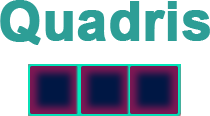

<h1 align="center">
    
</h1>

<h4 align="center"> 
	:heavy_check_mark: 🚀 Quadris Game 🚀 :heavy_check_mark:
</h4>

  <a href="#-projeto">Projeto</a>&nbsp;&nbsp;&nbsp;|&nbsp;&nbsp;&nbsp;
  <a href="#%EF%B8%8F-demonstração">Demonstração</a>&nbsp;&nbsp;&nbsp;|&nbsp;&nbsp;&nbsp;
  <a href="#-tecnologias">Tecnologias</a>&nbsp;&nbsp;&nbsp;|&nbsp;&nbsp;&nbsp;
  <a href="#memo-licença">Licença</a>

## 🈸 Projeto

Quadris Game é um jogo simples cujo objetivo é encaixar as peças uma em cima da outra até o final do topo

## 📽️ Demonstração
https://user-images.githubusercontent.com/71707151/182917774-428435a7-a3e1-44e0-9d91-a769dcb15f3e.mp4

## 🚀 Tecnologias

O projeto foi desenvolvido utilizando as seguintes tecnologias:

- [HTML5](https://www.w3schools.com/html/)
- [CSS](https://www.w3schools.com/css/)
- [JavaScript](https://www.javascript.com)

## :memo: Licença
Este projeto está sob a licença do MIT. Consulte a [LICENÇA](LICENSE) para obter detalhes.
